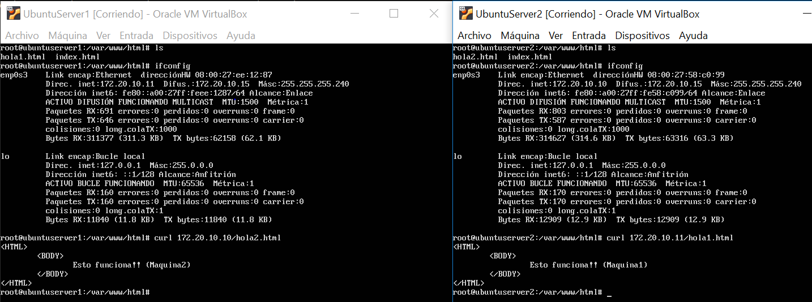
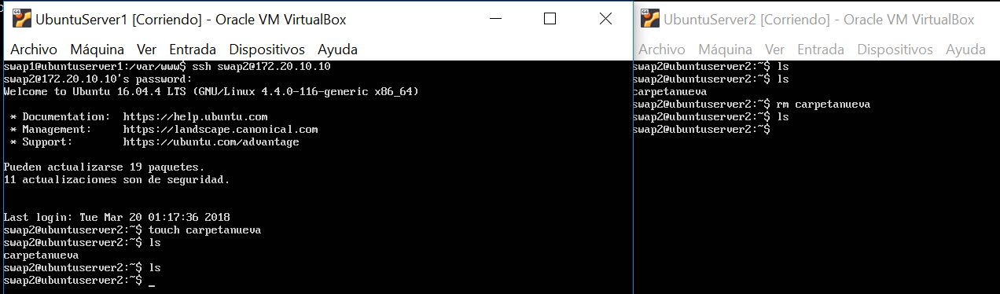
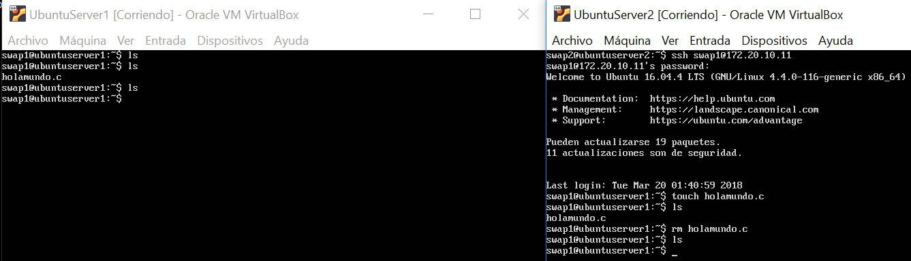

# Practica 1. SERVIDORES WEB DE ALTAS PRESTACIONES. UGR
## Preparación de las herramientas

## Pasos:

### 1. Descargamos [Ubuntu Server](http://www.ubuntu.com/download/server)

### 2. Configuramos dos maquinas virtuales con la iso de UbuntuServer con [Virtual Box](https://www.virtualbox.org/), a la primera la llamaremos swap1 y a la segunda swap2.

### 3. Seguimos paso a paso el [Proceso de instalación](http://www.ubuntugeek.com/step-by-step-ubuntu-12-04-precise-lamp-server-setup.html)
En nuestro caso en las opciones de red de la máquina virtual, el adaptador 1 lo conectaremos a: "Adaptador Puente". Esta configuración nos permitirá realizar las practicas con un dispositivo móvil compartiendo Internet con la computadora.

### 4. Definimos password root
```
sudo passwd root
```

### 5.Instalamos Curl en cada máquina para comprobar que el servidor web está activo.

```
sudo apt-get install curl
```

### 6. Hemos creado el archivo "hola.html" en /var/www/hola.html de cada una de las máquinas
```
 sudo touch /var/www/hola.html
```

El archivo sería:

```
<HTML>
    <BODY>
      Apache está funcionando en la otra máquina
    </BODY>
</HTML>
```

### 7. Accedemos con:
```
curl direccionIPdelservidor/hola.html
```


### 8. Igualmente accedemos por ssh de una máquina a otra:
```
ssh swap2@direccionIPdelservidor
```

## Resultados:
### 1. Acceso mediante la herramienta curl desde una máquina a la otra:



### 2 Acceso mediante ssh de la máquina 1(swap1) a la máquina 2(swap2):



### 3 Acceso mediante ssh de la máquina 2(swap2) a la máquina 1(swap1):


