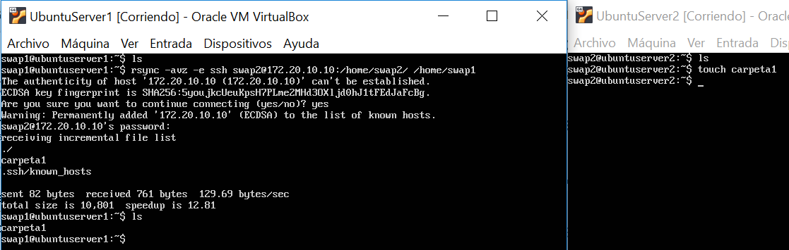
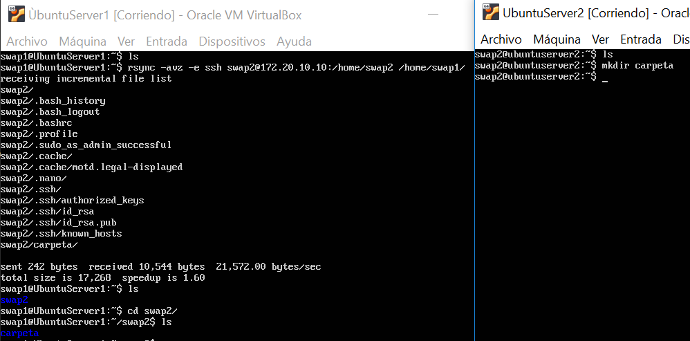
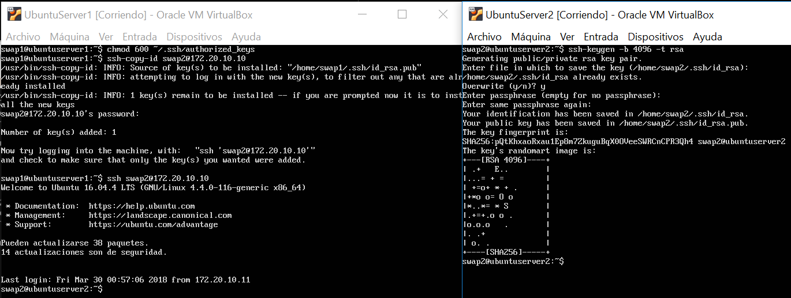
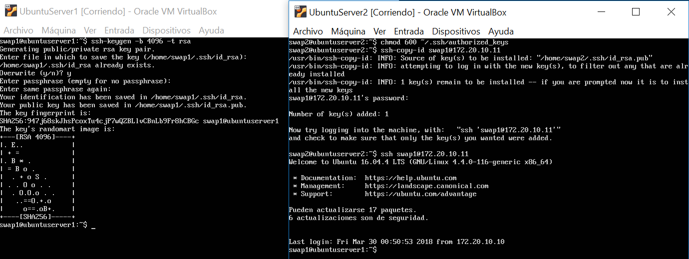
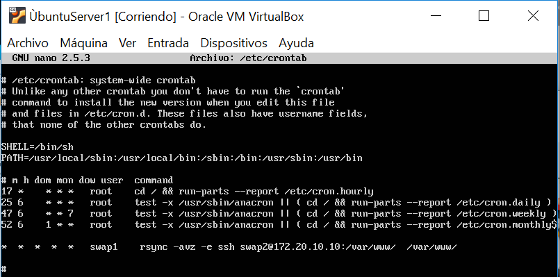
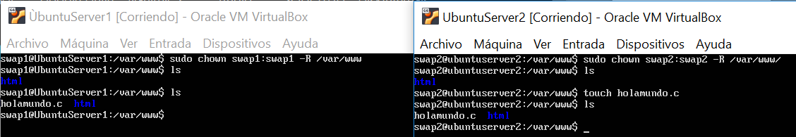

# Practica 2. SERVIDORES WEB DE ALTAS PRESTACIONES. UGR
## Clonar la información de un sitio web

## Pasos:

### 1. Instalamos la herramienta rsync
```
sudo apt-get install rsync
```

Para usar la herramienta y clonar un directorio cualquiera:
```
rsync -avz -e ssh ipmaquina2:dirmaquina_2 dir_maquina1
```
**Nota:**
*Para que nuestro usuario (swap1) sea el dueño de la carpeta donde residen los archivos que hay en el espacio web (swap2), en ambas máquinas ejecutamos:*
```
sudo chown usuario_actual:usuario_actual –R /var/www
```
### 2. Acceder sin contraseña con ssh de una máquina1 a la máquina2
**Escribimos en la Máquina Secundaria:**
```
ssh-keygen -b 4096 -t rsa
```

**Escribimos en la Máquina Principal:**
```
chmod 600 ~/.ssh/authorized_keys
```
```
ssh-copy-id user_maquinasecundaria@direccionIPmaquinasecundaria
```

###3.Programar tareas con crontab (se ubica en /etc/crontab)
cron es un administrador procesos en segundo plano que ejecuta procesos en el
instante indicado en el fichero crontab (se encuentra en */etc/crontab*).

Para automatizar un nuevo proceso hay que seguir el siguiente orden:

*Minuto Hora DiaDelMes Mes DiaDeLaSemana Usuario Comando*

30 15 * * *   usuario_actual rsync -avz -e ssh usuario_actual@ip_maquina2:/

Un ejemplo podría ser la siguiente tarea, la cual eliminará todos los archivos de la carpeta /tmp todos los jueves (día 4 de la semana) a la 15:30h :
```
30 15 * * 4 root rm /tmp/*
```


El valor * indica el valor "todo"(Ejemplo: si el * se encuentra en horas indica a cualquier hora del día).

El valor */n indica cada n veces:
    **Ejemplo:** La siguiente orden apagará el ordenador cada 3 minutos.
*/3 * * * * root poweroff 


## Resultados:
### 1. Conexion rsync accediendo con contraseña con ssh a la otra máquina

 

### 2. Conexion rsync accediendo sin contraseña con ssh a la otra máquina

 


### 3. Conexion ssh de la máquina principal (swap1)  a la secundaria (swap2)



### 4. Conexion ssh de la máquina secundaria (swap2)  a la principal (swap1)



### 5. Modificación del archivo crontab (Ubicado en /etc/crontab)

 

### 6. Programación de la tarea creada en crontab una vez realizado chown swap1:swap1 -R /var/www

 


