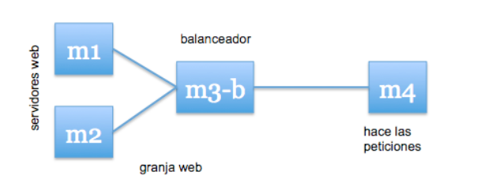
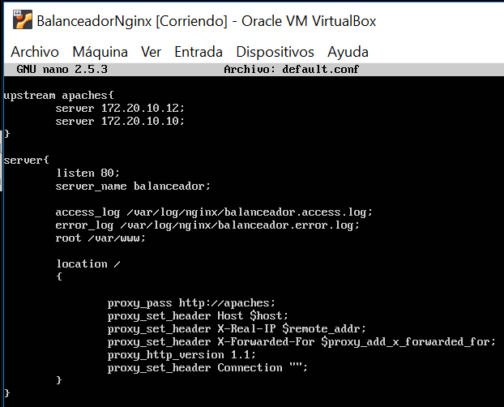
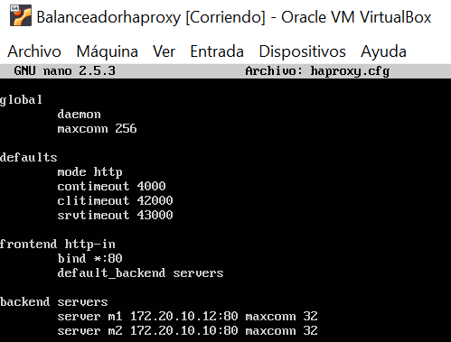
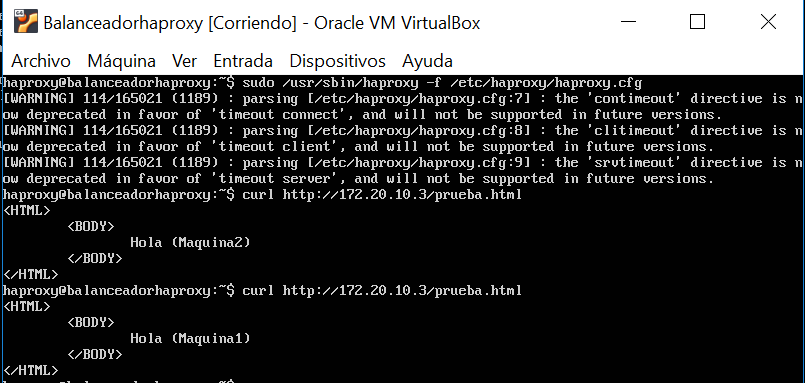
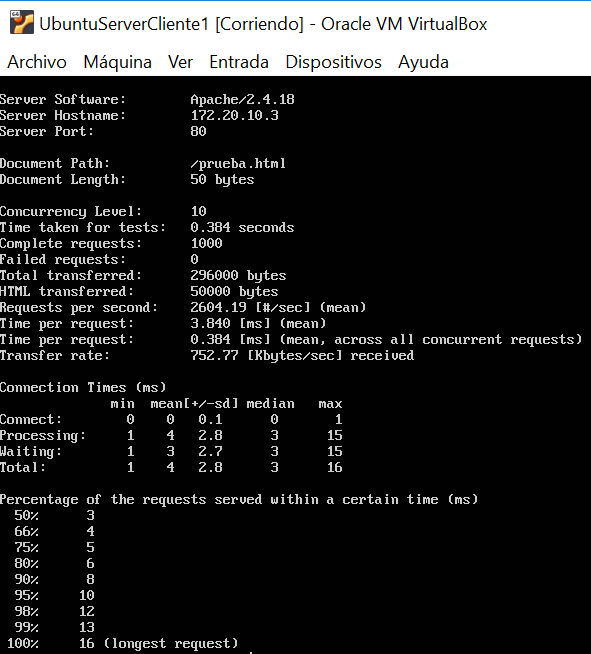

# Practica 3. SERVIDORES WEB DE ALTAS PRESTACIONES. UGR
## Balanceo de carga

En esta práctica configuraremos una red entre varias máquinas de forma que tengamos un balanceador que reparta la carga entre varios servidores finales.

Utilizaremos balanceo por software. Existen
varias alternativas para balancear HTTP por software:
•  [HaProxy](http://haproxy.1wt.eu/)
•  [Pound]( http://www.apsis.ch/pound/)
•  [Varnish]( http://varnish-cache.org)
•  [NginX]( http://nginx.org/)
•  [Lighty]( http://www.lighttpd.net/)
•  [Apache]( http://httpd.apache.org/)


Los dos primeros son balanceadores y proxy, pueden balancear cualquier tipo de tráfico. Los últimos tres son servidores web que pueden hacer estas funciones (Apache necesita usar los módulos mod_proxy o mod_proxy_balancer). Lighttpd es un servidor web liviano que soporta balanceo de carga pero no mantiene la sesión del usuario. Por último, nginX es otro servidor web liviano que sí soporta sesiones.

De todas estas opciones utilizaremos nginx configurado como proxy, y haproxy.

Debemos crear la siguiente organización de red:
 

###Nota:
Creamos una tercera máquina en la que no debe haber ningún software que se apropie del puerto 80, ya que lo necesitará el software de balanceo para recibir
las peticiones HTTP desde fuera de la granja web. Así pues, en esta máquina-3 no podemos tener instalado el Apache.


## Pasos para instalar el servidor web con nginx:
(Podemos seguir el siguiente [tutorial](https://www.liberiangeek.net/2016/07/how-to-install-nginx-webserver-on-ubuntu-16-04/) mas detallado)

### 1. Instalamos nginx
Una vez instalado el sistema básico Ubuntu Server, (Sin Apache) ejecutamos las siguientes ordenes:
```
sudo apt-get update && sudo apt-get dist-upgrade && sudo apt-get autoremove
sudo apt-get install nginx
sudo systemctl start nginx
```

### 2.Configuramos nginx
La configuración inicial de nginx no nos vale tal cual está, vamos a modificar el fichero de configuración:
```
sudo nano /etc/nginx/conf.d/default.conf
```
(Si ya tenia contenido lo eliminamos)
Podemos añadir la siguiente configuración usando balanceo mediante el algoritmo round-robin: 
(La sección de upstream indicamos las ip de las máquinas servidoras finales)

 


### 3.Lanzamos el servicio nginx:
```
sudo systemctl start nginx
```

### 4.Comprobamos el servicio nginx:
Si no obtenemos ningún mensaje de error, podemos probar la configuración:
```
curl http://172.16.168.132/prueba.html
curl http://172.16.168.132/prueba.html
```
Debería mostrar la pagina prueba.html de cada una de las máquinas.

 

Si al lanzarlo hemos tenido un error no está funcionando el balanceador, hay que eliminar una línea que configura nginx como servidor web en el
archivo /etc/nginx/nginx.conf
 

### 5. Opciones de configuración de nginx (Opcional)
* Si nos interesa que todas las peticiones que vengan de la misma IP se dirijan a la misma máquina servidora final, alteramos en el archivo default.conf:
```
upstream apaches {
	ip_hash;
	server ipmaquinafinal1;
	server ipmaquinafinal2;
}
```
(Nota: Esto puede suponer un balanceo No equilibrado)

* Es posible utilizar conexiones con keepalive entre nginx y los servidores finales, de forma que se realice una conexión con una persistencia de múltiples peticiones HTTP en lugar de abrir una conexión nueva cada vez (alteramos en el archivo default.conf):
```
upstream apaches {
	server ipmaquinafinal1;
	server ipmaquinafinal2;
	keepalive 3;
}
```
* También podemos añadir:

	-Para especificar un peso para el servidor (por defecto es 1).
	```
	weight = NUMBER
	```

	-Para especificar un nº de intentos de comunicación erróneos en "fail_timeout"
	segundos para considerar al servidor no operativo (por defecto es 1, un valor de 0 lo desactivaría).
  	```
  	fail_timeout = TIME
	```
	-marcar el servidor como permanentemente offline (para ser usado con ip_hash).

	```
	down
	```

	-Para reservar un servidor y sólo se le pasa tráfico si alguno de los otros servidores nobackup está caído u ocupado. No es compatible con la directiva ip_hash:
	```
	backup
	```
	*Ejemplos de uso*
	
	```
	upstream backend {
		server maquina1 weight=5;
		server 127.0.0.1:8080 max_fails=3 fail_timeout=30s;
		server maquina3;
	}
	```

	```
	upstream backend {
		ip_hash;
		server maquina1;
		server maquina2;
		server maquina3 down;
	}
	```
## Pasos para instalar el servidor web con haproxy:
### 1. Instalamos nginx
Tras instalar el sistema básico al igual que con nginx instalamos haproxy:
```
sudo apt-get install haproxy
```
### 2. Configuramos haproxy
```
sudo nano /etc/haproxy/haproxy.cfg
```
Usamos la siguiente configuración inicial (El balanceador debe escuchar el tráfico en el puerto 80 y redirigirlo a alguna de las máquinas finales):
 

### 3. Comprobamos el funcionamiento del balanceador haproxy

 

### 4. Someter a una alta carga el servidor balanceado.
Vamos a usar la herramienta Apache Benchmark para comprobar el rendimiento del servidor web (Creamos una nueva máquina **cliente** al igual que las dos máquinas servidoras finales y ejecutamos el siguiente comando):

```
ab -n 1000 -c 10 http://ipdelbalanceador/prueba.html
```
(Hace 1000 peticiones concurrentemente de 10 en 10).

El resultado que obtenemos es el siguiente:
 


###ANEXO

* Si queremos comprobar si hay algún servicio ocupando el puerto 80:
```
netstat –tulpn | grep :80
```

* Para comprobar que hay conexiones activas y desde que IP:
```
netstat –an | grep :80 | sort
netstat | grep http | wc -l
``` 


