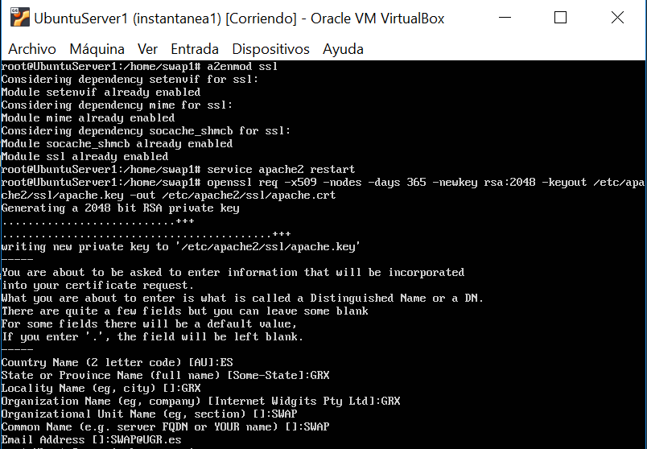
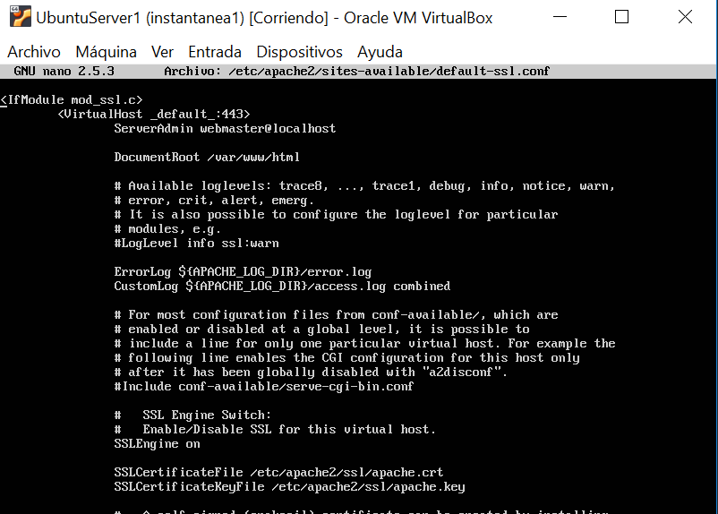
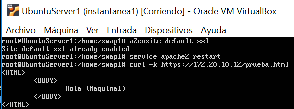
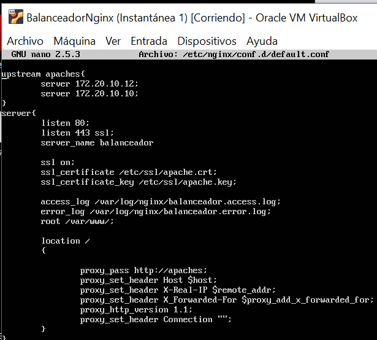
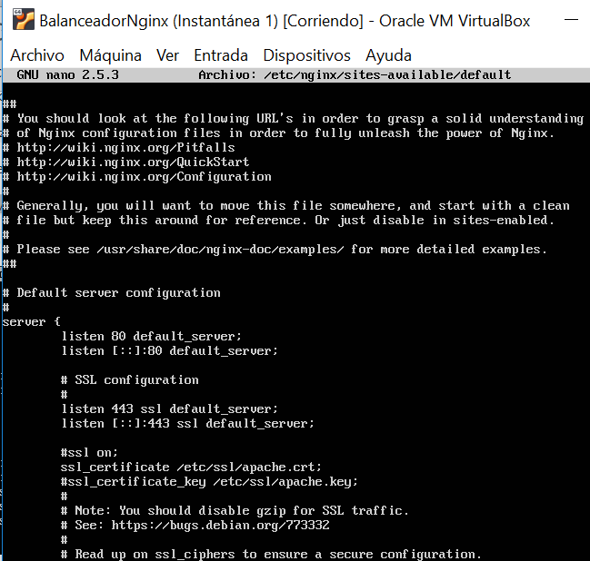
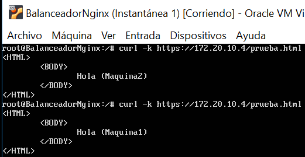
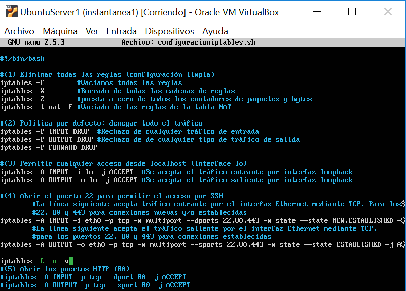
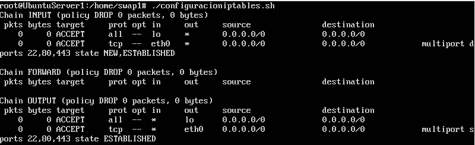

# Practica 4. SERVIDORES WEB DE ALTAS PRESTACIONES. UGR
## Asegurar la granja web
Los Objetivos son los siguientes:
Instalar un certificado SSL para configurar el acceso HTTPS a los servidores.
Configurar las reglas del cortafuegos para proteger la granja web.
## Pasos:

### 1. Instalamos un certificado SSL autofirmado (acceder mediante HTTPS)
Generamos e instalamos un certificado autofirmado y reiniciamos apache
(apache2 enable mods)
```
sudo a2enmod ssl
sudo service apache2 restart
```
Configuramos el dominio (creamos la carpeta ssl si no estaba creada):
```
mkdir /etc/apache2/ssl

sudo openssl req -x509 -nodes -days 365 -newkey rsa:2048 -keyout
/etc/apache2/ssl/apache.key -out /etc/apache2/ssl/apache.crt
```
 

Editamos el archivo de configuración del sitio default-ssl
```
sudo nano /etc/apache2/sites-available/default-ssl
```
Añadimos debajo de "SSLENGINE on"
```
SSLCertificateFile /etc/apache2/ssl/apache.crt

SSLCertificateKeyFile /etc/apache2/ssl/apache.key
```
 

Activamos el sitio default--ssl y reiniciamos apache:
```
sudo a2ensite default-ssl
sudo service apache2 restart
```
Ya podemos hacer peticiones por HTTPS con curl:

 ```
 curl –k https://ipmaquina1/archivo.html
 ```
 

**Instalamos el mismo certificado también en la máquina 2 (swap2)**

Podemos moverlo con rsync:
```
rsync -avz -e ssh swap1@172.20.10.12:/etc/apache2/ssl/* /etc/apache2/ssl/
```
**Vamos a instalar el certificado en nginx:**

1º Vamos a copiar los certificados SSL:
```
sudo rsync -avz -e ssh swap1@172.20.10.12:/etc/apache2/ssl/* /etc/ssl/
```
2º Modificamos el archivo default.conf
```
nano /etc/nginx/conf.d/default.conf
```


3º Reiniciamos nginx
```
sudo systemctl restart nginx
```


4º Probamos que funcione curl con https
```
curl -k https://IPBalanceador/prueba.html
```
 

### 2. Configuración del cortafuegos
Un cortafuegos es un componente esencial que protege la granja web de accesos indebidos. Son dispositivos colocados entre subredes para realizar diferentes tareas de manejo de paquetes. Actúa como el guardián de la puerta al sistema web,permitiendo el tráfico autorizado y denegando el resto.

En general, todos los paquetes TCP/IP que entren o salgan de la granja web deben pasar por el cortafuegos, que debe examinar y bloquear aquellos que no cumplan los criterios de seguridad establecidos. Estos criterios se configuran mediante un conjunto de reglas, usadas para bloquear puertos específicos, rangos de puertos, direcciones IP, rangos de IP, tráfico TCP o tráfico UDP.
### 2.1 Configuración del cortafuegos iptables en Linux
iptables es una herramienta de cortafuegos, de espacio de usuario, con la que el superusuario define reglas de filtrado de paquetes, de traducción de direcciones de red, y mantiene registros de log. 
Para mas ayuda:
```
man iptables
```
o bien:
```
iptables -h
```

**Para comprobar el estado del cortafuegos ejecutamos:**
```
iptables –L –n -v
```
Para configurar adecuadamente iptables en una máquina Linux, conviene establecer como reglas por defecto la denegación de TODO el tráfico, salvo el que permitamos después explícitamente. Una vez hecho esto, a continuación definiremos nuevas reglas para permitir el tráfico solamente en ciertos sentidos necesarios, ya sea de entrada o de salida. Por último, definiremos rangos de direcciones IP a los cuales aplicar diversas reglas, y mantendremos registros (logs) del tráfico no permitido y de intentos de acceso para estudiar más tarde posibles ataques.

**Vamos a configurar el cortafuegos en una de las máquinas servidoras finales (swap1)**

**Para lanzar, reiniciar o salvar las reglas establecidas en el cortafuegos respectivamente**
```
service iptables start

service iptables restart

service iptables stop

service iptables save
```
**Para bloquear todo el tráfico ICMP (ping) (y evitar ataques como el ping de la muerte):**
```
iptables -A INPUT -p icmp --icmp-type echo-request -j DROP
``` 
**Para abrir el puerto 53 para permitir el acceso a DNS:**
```
iptables -A INPUT -m state --state NEW -p udp --dport 53 -j ACCEPT
iptables -A INPUT -m state --state NEW -p tcp --dport 53 -j ACCEPT
```
**Bloquear todo el tráfico de entrada desde una IP:**
```
iptables -I INPUT -s IPbloqueada -j DROP
```
**Bloquear todo el tráfico de salida hacia una IP:**
```
iptables -I OUTPUT -s IPbloqueada -j DROP
``` 


### 2.2 Podemos crearnos un script con las reglas para que se ejecute al arrancar el sistema

(1) Eliminar todas las reglas (configuración limpia)
```
iptables -F           -->vaciado de todas las reglas
iptables -X           -->borrado de todas las cadenas de reglas
iptables -Z           -->puesta a cero de todos los contadores de paquetes y bytes
iptables -t nat -F    -->vaciado de las reglas de la tabla NAT
```
(2) Política por defecto: denegar todo el tráfico
```
iptables -P INPUT DROP
iptables -P OUTPUT DROP
iptables -P FORWARD DROP
```
(3) Permitir cualquier acceso desde localhost (interface lo)
```
iptables -A INPUT -i lo -j ACCEPT
iptables -A OUTPUT -o lo -j ACCEPT
```
(4) Abrir el puerto 22 para permitir el acceso por SSH
```
iptables -A INPUT -p tcp --dport 22 -j ACCEPT
iptables -A OUTPUT -p tcp --sport 22 -j ACCEPT
```
(5) Abrir los puertos HTTP (80) de servidor web
```
iptables -A INPUT -p tcp --dport 80 -j ACCEPT
iptables -A OUTPUT -p tcp --sport 80 -j ACCEPT
```
(6) Abrir los puertos HTTPS (443) de servidor web
```
iptables -A INPUT -p tcp --dport 443 -j ACCEPT
iptables -A OUTPUT -p tcp --sport 443 -j ACCEPT
``````

**Para volver a la configuración de la máquina inicial y permitir todo el tráfico**
```
**Eliminar todas las reglas (configuración limpia)**
iptables -F
iptables -X
iptables -Z
iptables -t nat -F
**política por defecto: aceptar todo**
iptables −P INPUT ACCEPT
iptables −P OUTPUT ACCEPT
iptables −P FORWARD ACCEPT
iptables -L -n -v
```

**Cuando terminemos nuestra configuración a nuestro gusto podemos comprobar los puertos que hay abiertos:**
```
netstat -tulpn
```
**Para saber si está abierto o cerrado el puerto 80 ejecutamos:**
```
netstat -tulpn | grep :80
```
**Nuestro script una vez ejecutado y realizada la configuración completa, teniendo ahora los puertos de HTTP, 
HTTPS y SSH con tráfico permitido en ambos sentidos para el protocolo TCP:**
 

La salida de nuestro script es la siguiente:


**Si queremos ejecutar nuestro script al arrancar el sistema**
Modificamos el archivo rc.local
```
sudo nano /etc/rc.local
```
Añadimos la ruta a nuestro script al final del archivo (antes de exit 0) y guardamos.
```
sh /home/swap1/configuracioniptables.sh &
```
