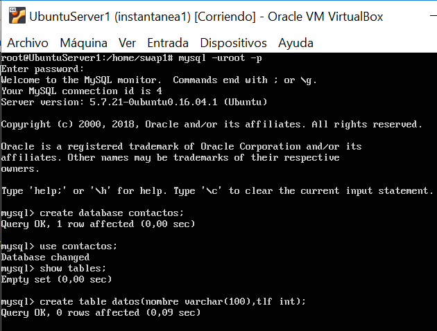

# Practica 5. SERVIDORES WEB DE ALTAS PRESTACIONES. UGR
## Replicación de bases de datos MySQL
Los objetivos concretos de esta práctica son:
*   Copiar archivos de copia de seguridad mediante ssh.
*   Clonar manualmente BD entre máquinas.
*   Configurar la estructura maestro-esclavo entre dos máquinas para realizar el clonado automático de la información(Maestro-Esclavo).

##NOTA:
**Durante toda la práctica estaremos con permisos de superusuario**
Para ello ejecutamos en ambas máquinas:

```
sudo su
```

## Pasos:


### 1. Crear una BD e insertar datos
Vamos a crear un Base de Datos en MySQL e insertamos algunos datos de ejemplo:
Para iniciar sesión en MySQL con permisos de usuario root, ejecutamos el comando:

```
mysql -u root -p 
``` 

```
mysql>create database ejemplodb;
mysql>use ejemplodb;
mysql>create table datos(nombre varchar(100),tlf int);
mysql>insert into datos(nombre,tlf) values ("pepe",95834987);
```

Comprobamos la existencia de la tabla y que nos muestra los datos correctamente introducidos:

```
mysql>show tables;
mysql>select * from datos;
mysql>describe datos;
```


### 2. Replicar una BD MySQL con mysqldump
Para realizar una copia de la BD completa en la máquina 2 (swap2), el primer paso es generar dicha copia en la máquina 1 (swap1), que denotaremos como principal, y el resto serán quienes obtengan dicha copia a partir de la principal. Nuestra copia ejemplodb.sql usando la herramienta mysqldump.


**Volvemos a entrar en MySQL**

```
mysql -u root -p
mysql> FLUSH TABLES WITH READ LOCK; #Bloqueamos la escritura en las tablas mientras son copiadas
mysql>quit;
mysqldump ejemplodb -u root -p > /tmp/ejemplodb.sql
mysql -u root -p
mysql>UNLOCK TABLES; 
```
**Restauramos dicha copia en la 2ª máquina (Nos vamos a swap2)**

```
scp usuariomaquina1@IP-MAQUINA1:/tmp/ejemplodb.sql /root/
mysql -u root -p
mysql>mysql -u root -p ejemplodb.sql < /tmp/ejemplodb.sql
```

**Nota:** Para asegurarnos podemos comprobar que el volcado de contenido se ha creado correctamente al igual que hicimos para swap1 en el paso 1.

### 3. Replicación de la BD automáticamente mediante una configuración maestro-esclavo de los servidores con MySQL

Podemos saber la versión de MySQL ejecutando: `mysql --version`

**En la máquina 1(swap1)**
* Si nuestra versión de MySQL es superior a la 5.0 alteramos el siguiente archivo:
```
nano /etc/mysql/mysql.conf.d/mysqld.cnf
```

* Si nuestra versión de MySQL es inferior a la 5.0 alteramos el siguiente archivo:
```
nano /etc/mysql/my.cnf
```

Realizamos los siguientes cambios en el archivo:

```
#bind-address 127.0.0.1
log_error = /var/log/mysql/error.log
server-id = 1
log_bin = /var/log/mysql/bin.log
```

Reiniciamos el servicio: 

```
/etc/init.d/mysql restart
```

**En la máquina 2(swap2)**
Aplicamos las mismas alteraciones que para la máquina 1 excepto para: `server-id = 2`


**Volvemos a la máquina 1(swap1)**
Ahora creamos el usuario esclavo, recargamos la información de tablas y privilegios además vamos a bloquear estas tablas ante nuevas escrituras.  

Introducimos los siguientes comandos en MySQL:
Para entrar usamos: `mysql -u root -p`

```
mysql>CREATE USER esclavo IDENTIFIED BY 'esclavo';
mysql>GRANT REPLICATION SLAVE ON *.* TO 'esclavo'@'%' mysql>IDENTIFIED BY 'esclavo';
mysql>FLUSH PRIVILEGES;
mysql>FLUSH TABLES;
mysql>FLUSH TABLES WITH READ LOCK;
```

Ejecutamos el comando  `SHOW MASTER STATUS;` para mostrar la información del maestro.

**Volvemos a la máquina 2(swap2)**
Introducimos la información
```
CHANGE MASTER TO MASTER_HOST='IPdelmaestro(swap1)', MASTER_USER='esclavo', MASTER_PASSWORD='esclavo', MASTER_LOG_FILE='bin.000001', MASTER_LOG_POS=980, MASTER_PORT=3306;
```
*NOTA:* EL valor 980 es el valor que nos haya mostrado la salida del comando `SHOW MASTER STATUS;` al ejecutarlo en la máquina maestra previamente.


Iniciamos el esclavo y mostramos el estado y configuración, **el campo Seconds_Behind_Master deberá aparecer un valor distinto a NULL** (por ejemplo un 0) para garantizar que el esclavo funciona correctamente

``` 
START SLAVE;
SHOW SLAVE STATUS\G

```
:tada:  :tada:  :tada: :tada: :tada: 

Ya se replican automáticamente los datos mediante la conexión maestro-esclavo entre nuestras dos máquinas.

:tada:  :tada:  :tada: :tada: :tada: 


### RESULTADOS

Capturas de la Creación de la Base de Datos




Alteración del archivo mysqld.cnf en la máquina 1


Ejecución de SHOW MASTER STATUS;


Salida de START SLAVE; y de SHOW SLAVE STATUS\G


Funcionamiento final de las máquinas realizando el clonado automático.


### NOTA: Recuerda como crear un tar con ficheros locales y copiarlos en un equipo remoto:
Crear un tar.gz con un directorio de un equipo y dejarloen otro mediante ssh.

```
tar czf - directorio | ssh equipodestino 'cat > ~/tar.tgz'
```


